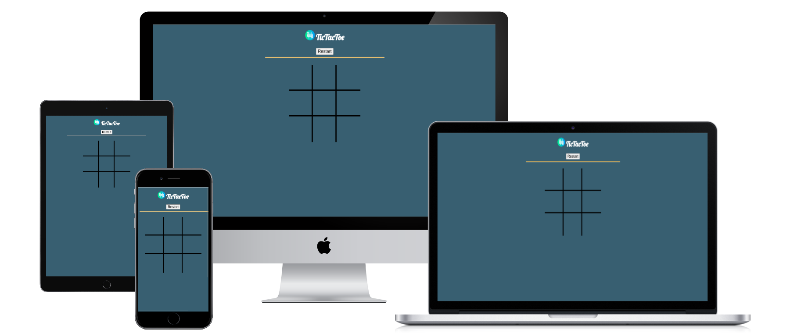
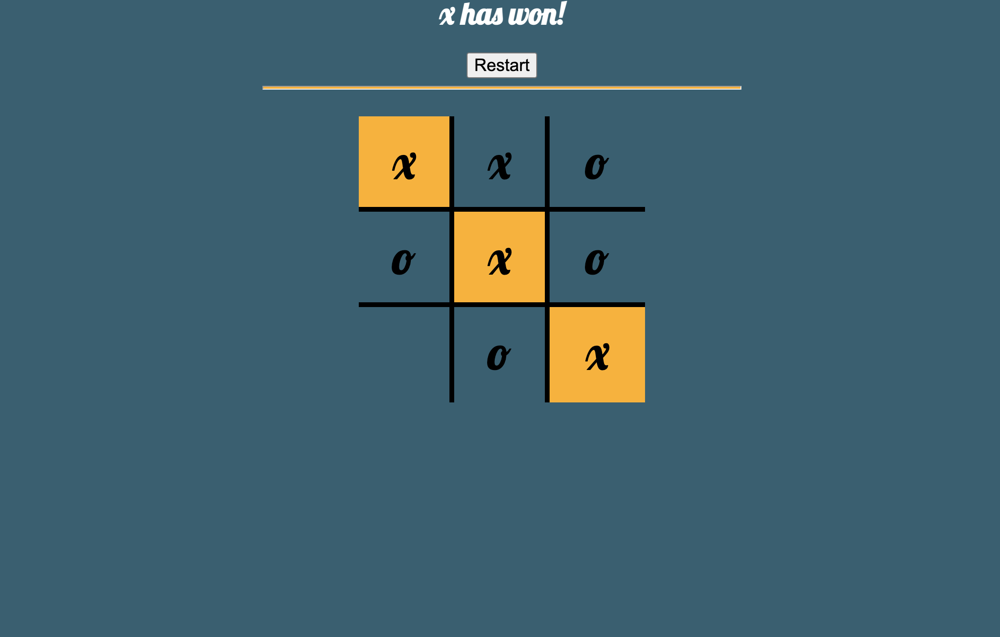
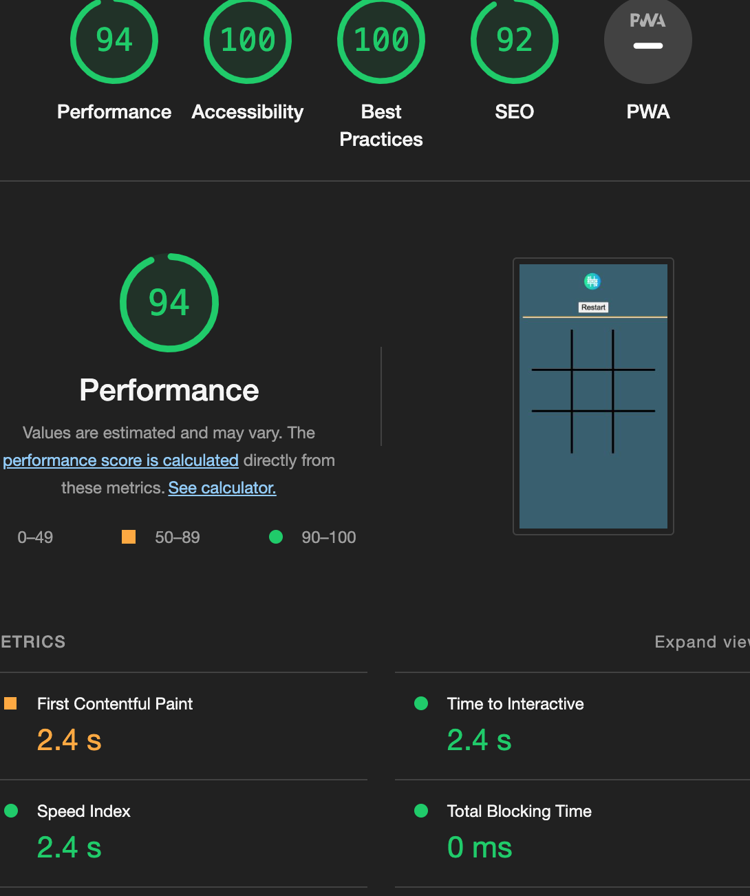
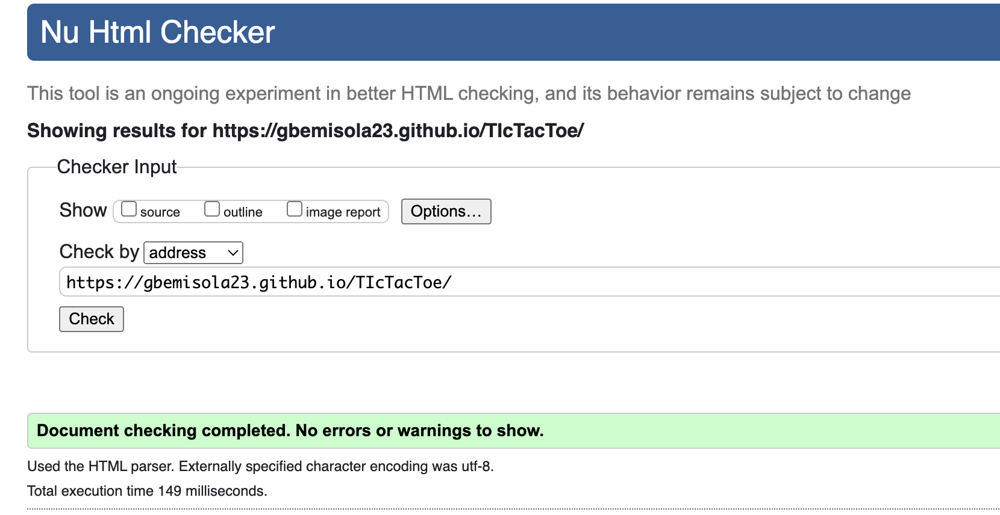
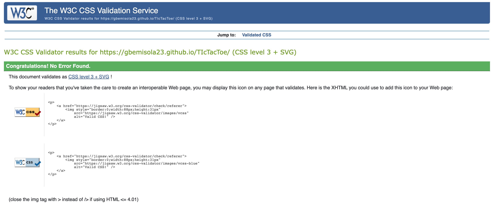

# TIcTacToe
# TicTacToe Portfolio

A game in which two players seek to play in alternate turns to complete a row, a column, or a diagonal with either three O's or three X's drawn in the spaces of a grid of nine squares; noughts and crosses.

The live website can be found here [TicTacToe Portfolio](https://gbemisola23.github.io/TIcTacToe/).

## Features

* **Header**
  - The header includes the title name and logo.
  - The body  includes the board game

## Testing

* I've tested that this page works well in desktop  and mobile verion.
* I've confirmed that this project is completely responsive on all screen sizes using dev tools.
* I confirmed by testing with users that the text of all sections is readable and easy to understand.

### Validator Testing

  * **HTML** 
    - No errors were found when passing through official W3C Validator.

  * **CSS**
    - No errors were returned when passing through the Jigsaw.
    
  * **JAVASCRIPT**
  -
  ![Javascript]
 -No errors were returned when passing through the Jshint.
 
  * **Unfixed**    
    - No unfixed bugs.
     
## Deployment

The site was deployed to Github. The steps to deploy are as follows:
   - Credits
- In the GitHub repository, navigate to the Settings tab.
- Select 'Settings' from the navigation bar near the top of the page.
- Select 'Pages' from the sidebar on the left of the page.
- From the source section drop-down menu, select the Master Branch.
- Once selected, click the 'Save' button to the right of the dropdown menu.
- Deployment should be confirmed by a message on a green background - The message should have a green tick mark followed by "Your site is published at" followed by the web address.
- Confirm deployment by navigating to the displayed web address.

 The live website can be found here; [TICTACTOE Portfolio](https://gbemisola23.github.io/TIcTacToe/).
  
 
## Credits

* Icons from [Flaticon](fhttps://www.flaticon.com/)
* Fonts from [https://fonts.google.com/]
* Some Code were adopted from LoveMaths Project, Code Institute.
* Html and Javascript code were  adopted from Web Dev Simplified, Siphiwo Julayi, Angle Brace on YouTube.
